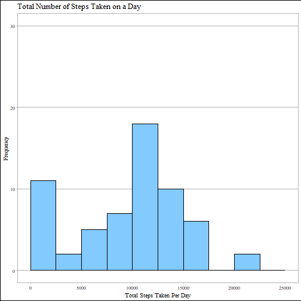
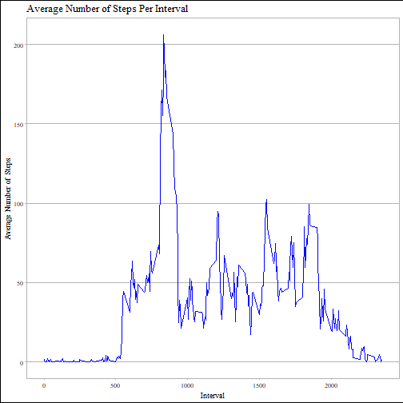
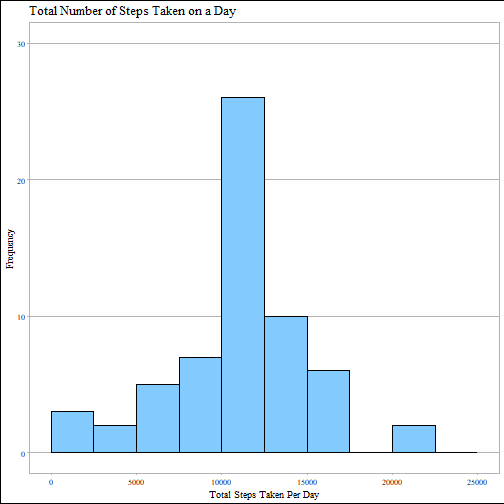
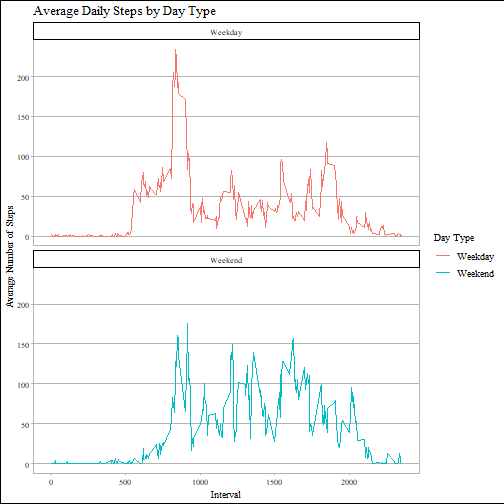

knitr::opts_chunk$set(echo = TRUE, warning = FALSE, fig.width = 10, fig.height = 5, fig.keep = 'all' ,fig.path = 'figures\ ', dev = 'png')

## Loading and preprocessing the data

Loading packages

```r
library(ggplot2)
library(ggthemes)
```

Reading downloaded file

```r
activity <- read.csv("activity.csv")
```

Setting date format to help get the weekdays of the dates

```r
activity$date <- as.POSIXct(activity$date, "%Y%m%d")
```

```
## Warning in strptime(xx, f, tz = tz): unknown timezone '%Y%m%d'
```

```
## Warning in as.POSIXct.POSIXlt(x): unknown timezone '%Y%m%d'
```

```
## Warning in strptime(xx, f, tz = tz): unknown timezone '%Y%m%d'
```

```
## Warning in as.POSIXct.POSIXlt(x): unknown timezone '%Y%m%d'
```

```
## Warning in strptime(xx, f, tz = tz): unknown timezone '%Y%m%d'
```

```
## Warning in as.POSIXct.POSIXlt(x): unknown timezone '%Y%m%d'
```

```
## Warning in strptime(xx, f, tz = tz): unknown timezone '%Y%m%d'
```

```
## Warning in as.POSIXct.POSIXlt(x): unknown timezone '%Y%m%d'
```

```
## Warning in strptime(xx, f, tz = tz): unknown timezone '%Y%m%d'
```

```
## Warning in as.POSIXct.POSIXlt(x): unknown timezone '%Y%m%d'
```

```
## Warning in strptime(x, f, tz = tz): unknown timezone '%Y%m%d'
```

```
## Warning in as.POSIXct.POSIXlt(as.POSIXlt(x, tz, ...), tz, ...): unknown timezone '%Y%m%d'
```

Getting the days of all the dates on the dataset

```r
day <- weekdays(activity$date)
```

```
## Warning in as.POSIXlt.POSIXct(x, tz): unknown timezone '%Y%m%d'
```

Combining the dataset with the weekday of the dates

```r
activity <- cbind(activity, day)
```

Viewing the processed data

```r
summary(activity)
```

```
## Warning in as.POSIXlt.POSIXct(x, tz): unknown timezone '%Y%m%d'
```

```
##      steps             date               interval          day           
##  Min.   :  0.00   Min.   :2012-10-01   Min.   :   0.0   Length:17568      
##  1st Qu.:  0.00   1st Qu.:2012-10-16   1st Qu.: 588.8   Class :character  
##  Median :  0.00   Median :2012-10-31   Median :1177.5   Mode  :character  
##  Mean   : 37.38   Mean   :2012-10-31   Mean   :1177.5                     
##  3rd Qu.: 12.00   3rd Qu.:2012-11-15   3rd Qu.:1766.2                     
##  Max.   :806.00   Max.   :2012-11-30   Max.   :2355.0                     
##  NA's   :2304
```

-------------------------------------------------------------------------------

## Q1: What is mean total number of steps taken per day?

Calculating total steps taken on a day

```r
activityTotalSteps <- with(activity, aggregate(steps, by = list(date), sum, na.rm = TRUE))
```

```
## Warning in as.POSIXlt.POSIXct(x, tz): unknown timezone '%Y%m%d'

## Warning in as.POSIXlt.POSIXct(x, tz): unknown timezone '%Y%m%d'
```

Changing col names

```r
names(activityTotalSteps) <- c("Date", "Steps")
```

Converting the data set into a data frame to be able to use ggplot2

```r
totalStepsdf <- data.frame(activityTotalSteps)
```

Plotting a histogram using ggplot2

```r
g <- ggplot(totalStepsdf, aes(x = Steps)) + 
  geom_histogram(breaks = seq(0, 25000, by = 2500), fill = "#83CAFF", col = "black") + 
  ylim(0, 30) + 
  xlab("Total Steps Taken Per Day") + 
  ylab("Frequency") + 
  ggtitle("Total Number of Steps Taken on a Day") + 
  theme_calc(base_family = "serif")

print(g)
```



# Mean of the total number of steps/day
mean(activityTotalSteps$Steps)

# Median of the total number of steps/day
median(activityTotalSteps$Steps)

-------------------------------------------------------------------------------

## Q2: What is the average daily activity pattern?

Calculating the average number of steps taken, averaged across all days by 5-min intervals.

```r
averageDailyActivity <- aggregate(activity$steps, by = list(activity$interval), FUN = mean, na.rm = TRUE)
```

Changing column names

```r
names(averageDailyActivity) <- c("Interval", "Mean")
```

Converting data set into a dataframe

```r
averageActivitydf <- data.frame(averageDailyActivity)
```

Plotting on ggplot2

```r
da <- ggplot(averageActivitydf, mapping = aes(Interval, Mean)) + 
  geom_line(col = "blue") +
  xlab("Interval") + 
  ylab("Average Number of Steps") + 
  ggtitle("Average Number of Steps Per Interval") +
  theme_calc(base_family = "serif")

print(da)
```



Which 5-minute interval, on average across all the days in the dataset, contains the maximum number of steps?

```r
averageDailyActivity[which.max(averageDailyActivity$Mean), ]$Interval
```

```
## [1] 835
```

-------------------------------------------------------------------------------

## Q3: Inputing missing values

Number of rows with NAs values

```r
sum(is.na(activity$steps))
```

```
## [1] 2304
```

Matching the mean of daily activity with the missing values

```r
inputedSteps <- averageDailyActivity$Mean[match(activity$interval, averageDailyActivity$Interval)]
```

Transforming steps in activity if they were missing values with the filled values from above.

```r
activityInputed <- transform(activity, steps = ifelse(is.na(activity$steps), yes = inputedSteps, no = activity$steps))
```

Forming the new dataset with the inputed missing values.

```r
totalActivityInputed <- aggregate(steps ~ date, activityInputed, sum)
```

```
## Warning in as.POSIXlt.POSIXct(x, tz): unknown timezone '%Y%m%d'

## Warning in as.POSIXlt.POSIXct(x, tz): unknown timezone '%Y%m%d'
```

Changing col names

```r
names(totalActivityInputed) <- c("date", "dailySteps")
```

Test if new dataset has no NA values

```r
sum(is.na(totalActivityInputed$dailySteps))
```

```
## [1] 0
```

Converting the data set into a data frame to be able to use ggplot2

```r
totalInputedStepsdf <- data.frame(totalActivityInputed)
```

Plotting a histogram using ggplot2

```r
p <- ggplot(totalInputedStepsdf, aes(x = dailySteps)) + 
  geom_histogram(breaks = seq(0, 25000, by = 2500), fill = "#83CAFF", col = "black") + 
  ylim(0, 30) + 
  xlab("Total Steps Taken Per Day") + 
  ylab("Frequency") + 
  ggtitle("Total Number of Steps Taken on a Day") + 
  theme_calc(base_family = "serif")

print(p)
```



# Mean of the total number of steps taken per day

```r
mean(totalActivityInputed$dailySteps)
```

```
## [1] 10766.19
```

# Median of the total number of steps taken per day

```r
median(totalActivityInputed$dailySteps)
```

```
## [1] 10766.19
```

## Q4: Are there differences in activity patterns between weekdays and weekends?

Updating format of the dates

```r
activity$date <- as.Date(strptime(activity$date, format="%Y-%m-%d"))
```

```
## Warning in as.POSIXlt.POSIXct(x, tz): unknown timezone '%Y%m%d'
```

Creating a function that distinguishes weekdays from weekends

```r
activity$dayType <- sapply(activity$date, function(x) {
  if(weekdays(x) == "Saturday" | weekdays(x) == "Sunday")
  {y <- "Weekend"}
  else {y <- "Weekday"}
  y
})
```

Creating the data set that will be plotted

```r
activityByDay <-  aggregate(steps ~ interval + dayType, activity, mean, na.rm = TRUE)
```

Plotting using ggplot2

```r
dayPlot <-  ggplot(activityByDay, aes(x = interval , y = steps, color = dayType)) + 
  geom_line() + ggtitle("Average Daily Steps by Day Type") + 
  xlab("Interval") + 
  ylab("Average Number of Steps") +
  facet_wrap(~dayType, ncol = 1, nrow=2) +
  scale_color_discrete(name = "Day Type") +
  theme_calc(base_family = "serif")

print(dayPlot) 
```




